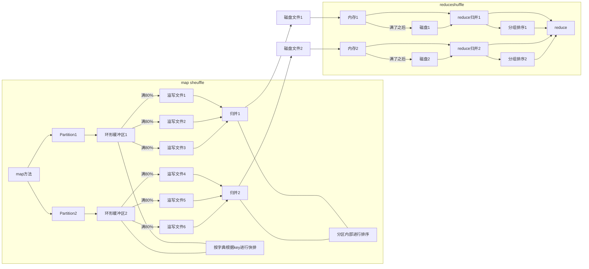
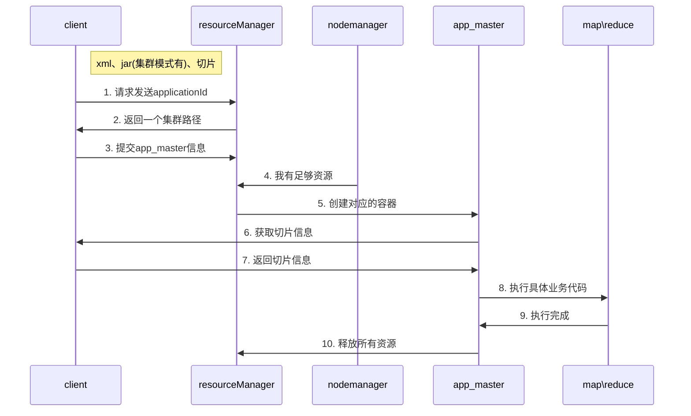

# hadoop 面试准备

<!-- TOC -->

- [hadoop 面试准备](#hadoop-面试准备)
  - [1. 入门](#1-入门)
    - [常用端口号](#常用端口号)
      - [2.X](#2x)
      - [3.X](#3x)
    - [安装配置文件](#安装配置文件)
      - [2.X](#2x-1)
      - [3.X](#3x-1)
  - [2. HDFS](#2-hdfs)
    - [读写流程 笔试题](#读写流程-笔试题)
    - [小文件问题](#小文件问题)
      - [小文件的危害](#小文件的危害)
      - [优化手段](#优化手段)
    - [HDFS 副本个数](#hdfs-副本个数)
    - [HDFS 块大小](#hdfs-块大小)
      - [2.X 3.X](#2x-3x)
      - [1.X](#1x)
      - [在企业中](#在企业中)
  - [3. MapReduce](#3-mapreduce)
    - [shuffle及其优化](#shuffle及其优化)
      - [shuffle过程](#shuffle过程)
      - [shuffle优化 数据倾斜解决](#shuffle优化-数据倾斜解决)
        - [压缩优化](#压缩优化)
      - [默认内存](#默认内存)
  - [4. Yarn](#4-yarn)
    - [调度器](#调度器)
      - [默认调度器](#默认调度器)
      - [FIFO](#fifo)
      - [容量调度器](#容量调度器)
      - [公平调度器](#公平调度器)
      - [企业选择](#企业选择)
      - [如何创建队列](#如何创建队列)
        - [容量调度器](#容量调度器-1)
    - [yarn 工作机制](#yarn-工作机制)
  - [其他优化](#其他优化)
  - [5. 数据倾斜](#5-数据倾斜)

<!-- /TOC -->

## 1. 入门

### 常用端口号

#### 2.X

1. 50070 -> HDFS

#### 3.X

1. 9870 -> HDFS web页面
2. 19888 -> 历史服务器 JobHistoryServer
3. 8088 -> MapReduce
4. 9000/8020 -> 客户端

### 安装配置文件

#### 2.X

slave 等价于 3.X workers

#### 3.X
1. core-site.xml -> 核心配置
2. hdfs-site.xml -> 文件系统配置
3. yarn-site.xml -> yarn配置 resourceManager等
4. mapred-site.xml -> 运行参数
5. workers -> 服务器信息

## 2. HDFS

### 读写流程 笔试题 
==搜一搜流程，画出流程图==

### 小文件问题

#### 小文件的危害

存和算两方面的危害

1. 占用namenode元数据内存
   不管文件多小，都要占用150字节
   128G内存 存储文件块元数据 128*1024*1024*1024/150 约等于9亿

2. 切片增多，进而影响mapTask个数（默认占用1G内存）增加了计算内存

#### 优化手段

1. har归档：
   ```mermaid
   graph LR;
   subgraph namenode;
   文件1
   文件2
   文件3
   文件4
   文件5
   文件6
   文件7
    end
    
   文件1 --汇总--> 大文件;
   文件2 --汇总--> 大文件;
   文件3 --汇总--> 大文件;
   文件4 --汇总--> 大文件;
   文件5 --汇总--> 大文件;
   文件6 --汇总--> 大文件;
   文件7 --汇总--> 大文件;
   
   大文件 --存储--> namenode新远数据
   
   ```
2. CombineTextInputformat 改变切片 ==还需要了解==
3. JVM 重用
   ```
   mapreduce.job.jvm.numtask 重用次数配置
   ```
### HDFS 副本个数
默认有3个副本
实战用机房个数以及机架个数来存储

### HDFS 块大小

主要取决于服务网之间的传输速度

#### 2.X 3.X 
默认 128M
本地模式32M

#### 1.X
默认64M

#### 在企业中
配置256M


## 3. MapReduce

### shuffle及其优化

map方法之后 reduce方法之前

#### shuffle过程



#### shuffle优化 数据倾斜解决

1. patition 自定义分区，打散key
2. 扩大环形缓冲区内存大小如200M，设置90%进行溢写 == 减少溢写文件
3. 写combiner 提前进行溢写，只限于求和计算
4. 默认一次归并 10 个溢写文件
5. 减少磁盘IO 使用压缩(快 `snappy`、LZO)
6. reduce默认一次拉取5个maptask结果，可以多获取一些数据 会增大内存使用


##### 压缩优化

1. map输入端
   小文件：速度块的压缩方式
   大文件：需要切片(`bzip2`、lzo)
2. map输出端
   快就好：`Snappy` LZO
3. reduce输出
   永久保存，压缩越小越好
   下个MR输入，数据量小考虑快，数据大，考虑切片

#### 默认内存

1. NM默认内存 == 8G 企业开发可调整 ALL：128G use：100G
2. 单任务默认内存 == 8G 生产环境根据实际数据调整（内存使用大概数据的8倍） 128M数据 == 1G内存 、 1G数据 == 8G内存
3. mapTask默认内存 == 1G 如果数据量大，且不支持切片，增大mapTask内存（4-6G）512M数据 == 4G内存
4. reduceTask默认内存 == 1G 


## 4. Yarn

### 调度器

#### 默认调度器

1. apache -- 容量调度器
2. CDH -- 公平调度器

#### FIFO

1. 支持单队列
2. 先进先出
3. 同时只有一个任务进行
4. 并发度非常低，不会再企业中使用

#### 容量调度器

1. 支持多队列，由多个FIFO调度器组成
2. 优先满足先进的任务
3. 可借用其他队列资源
4. 其他队列有任务时需要归还资源
5. 并发度一般

#### 公平调度器

1. 同时启动所有任务，平均享用资源
2. 并发度最高

#### 企业选择

1. 电脑性能好，并发度要求高 -- 公平调度器
   >如上市公司、大厂
2. 电脑性能比较差，并发度要求不高 -- 容量调度器
   >如中小型公司

#### 如何创建队列

##### 容量调度器

默认只有一个default队列

1. 按照执行任务的框架创建：hive、spark、flink
2. 按照业务模块创建：登陆注册模块、订单、物流 == 企业首选

临时降级使用
如物流队列不使用，先用订单与登录注册

### yarn 工作机制



## 其他优化

mapreduce.map.java.opts == 控制 mapTask 堆内存大小 oom报错第一个调


## 5. 数据倾斜

1. 通过combiner 提前统计数据，使 mr 之间通信数据减少
2. null倾斜，添加随机值

