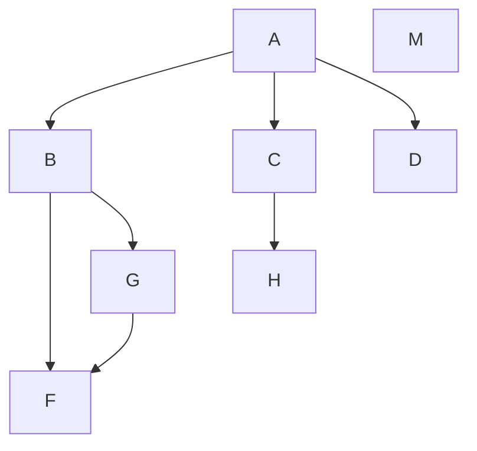
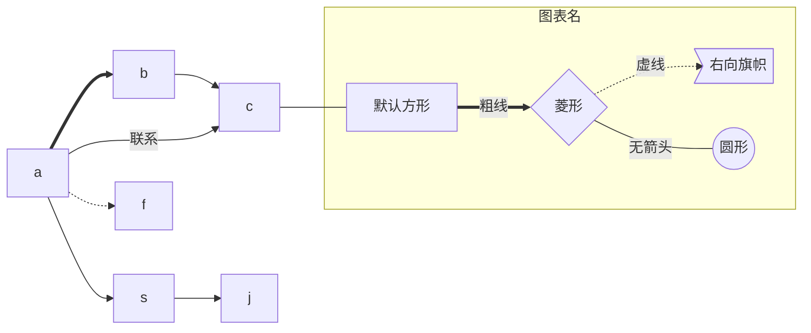
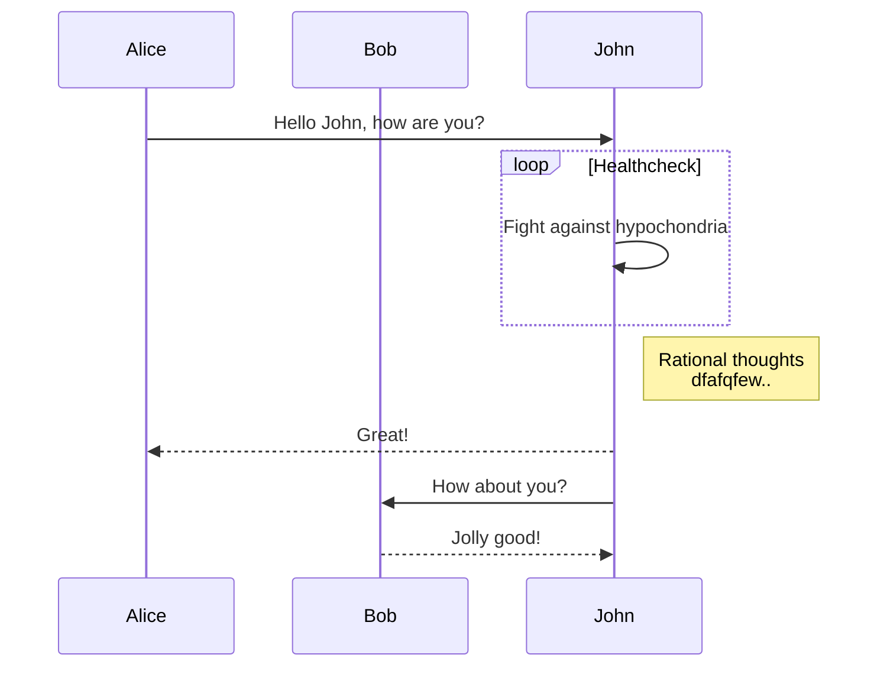
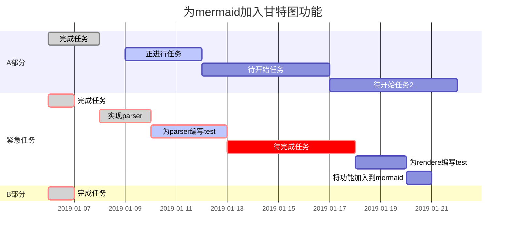

# 流程图标准

## flowchart 流程图

## 语法

1. 方向

|符号|意义|
|:----|----:|
|TB|从上到下|
BT | 从下到上
RL | 从右到左
LR | 从左到右

2. 连线类型

|符号|意义|
|:----|----:|
– | 单线
–text-- | 单线上加文字
== | 粗线
\=\=text\=\= | 粗线加文字
-.- | 虚线
-.text.- | 虚线加文字

3. 节点

|符号|意义|
|:----|----:|
id[文字] | 矩形节点
id(文字) | 圆角矩形节点
id((文字)) | 圆形节点
id>文字] | 右向旗帜状节点
id{文字} | 菱形节点

## Sequence diagram(顺序图)

## 甘特图(Gantt diagram)

